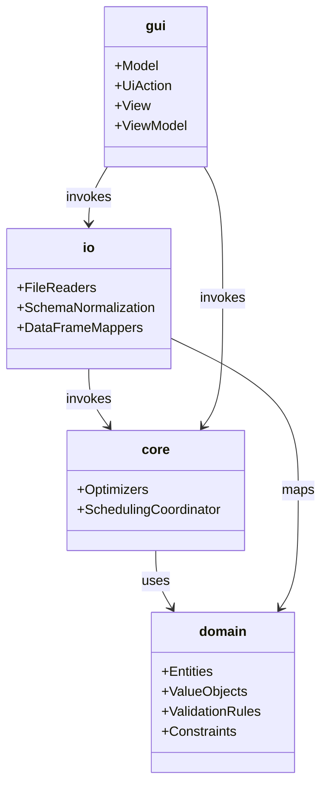
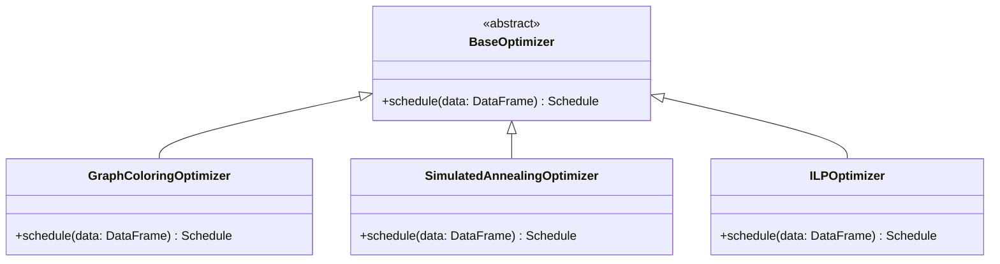
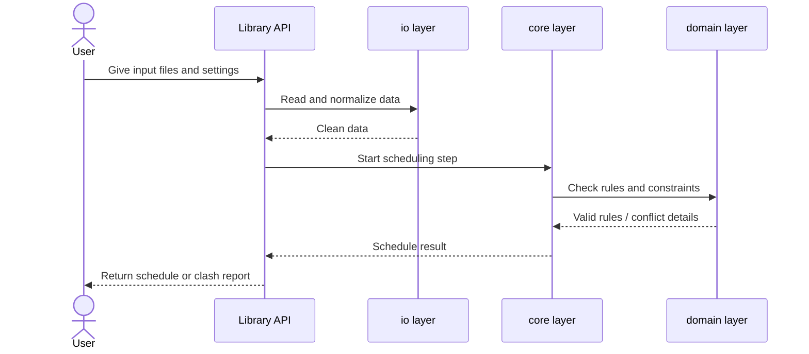
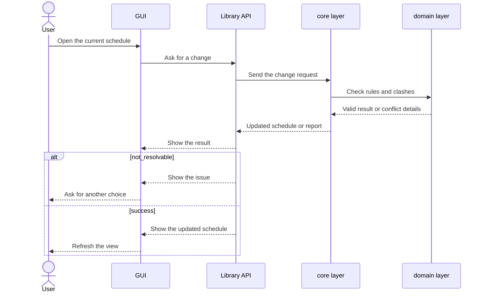

# Unisched Implementation Project Plan

## Objective and Scope

The goal of this project is to create a university exam scheduler framework in a highly structured, scalable, and modern Python library and application. The project strictly adheres to Object-Oriented Programming (OOP) principles, emphasizing modularity, extensibility, and maintainability.

### Core Features
- **Generic Data Pipeline**: Standardized file reading, bringing all inputs into a single format (pandas `DataFrame` instead of raw graph structures for data handling) utilized by the entire library.
- **Pluggable Optimizer Architecture**: An extensible approach utilizing inheritance to support multiple scheduling algorithms.
- **Advanced Hall Allocation**: Dedicated algorithms to optimally assign lecture halls.
- **Stable Public API**: A well-documented interface for advanced users to leverage the package programmatically.
- **Modern Responsive GUI**: A clean, MVVM-based graphical interface with real-time interactive scheduling adjustments supported by the core library.

## Architectural Design

I want to use a simple layered architecture. The idea is to separate data models, application flow, file handling, and UI so each part is easy to understand, test, and change.

### Core Modules
1. **`unisched.domain`**: Contains the main exam scheduling concepts and rules. This includes models like `Course`, `Student`, `ExamHall`, `TimeSlot`, `Schedule`, and `Constraint`.
2. **`unisched.core`**: Handles app-level flow. It runs scheduling steps, connects optimizers, checks scheduling constraints, and exposes a clean API.
3. **`unisched.io`**: Handles input/output. Reads files (CSV, Excel, etc.), normalizes schema, and converts data to/from pandas `DataFrame`.
4. **`unisched.gui`**: The UI layer (MVVM). It only handles interaction and display, and calls `core` for scheduling logic.

### Simple Dependency Rule
The dependency direction is:
- `domain` depends on nothing else.
- `core` depends on `domain`.
- `io` and `gui` depend on `core`.
- `io` may map file data into domain models before handing it to `core`.
- Models and scheduling rules stay in `domain`, app flow stays in `core`, and file/UI concerns stay in `io`/`gui`.
- `io` handles file/schema validation, while `core` and `domain` handle scheduling checks.

### Optimizer Architecture (OOP)
A base `BaseOptimizer` class will define the interface for all scheduling algorithms. This ensures extensibility.

* **BaseOptimizer** (Abstract Base Class)
    * `GraphColoringOptimizer`
    * `SimulatedAnnealingOptimizer`
    * `ILPOptimizer` (Integer Linear Programming)

### API Usage Flow
The library API should feel simple to use. First, the user gives the data to `io`, then `core` prepares the schedule using the chosen optimizer, and finally the result comes back as a schedule or a clash report. The API should hide the internal steps so the user only sees a clear start point and a clear output.

Example flow:
- load exam and student data
- normalize the input into a common format
- choose an optimizer
- generate the schedule
- check the result and return it

### Interactive GUI
The GUI should also be able to make small updates after a schedule is already built. For example, the user may move one exam to a new date or switch it to another hall. The core part of the library should then recheck the schedule, fix any clash if possible, and return the updated result.

Possible actions:
- move one course to a new date
- change the hall for one exam
- recheck clashes after each change
- return either an updated schedule or a problem report

## Goals

### Logging
- Implement a logging system to track the scheduling process and any issues that arise.

### Foundation & Data Pipeline
- Define main entities and rules in `domain`.
- Implement the `io` module to read various formats and normalize into `pandas.DataFrame`.
- Support csv, Excel and ODS input formats.
- Implement schema validation and structural boundaries.

### Optimizer Framework & Graph Coloring
- Create the `BaseOptimizer` interface in `core`.
- Implement the `GraphColoringOptimizer` as the first concrete algorithm (adapting the logic from my old project with Dr. Prafullkumar Tale but in the new structure).
- Implement the baseline hall allocation algorithm.

### Advanced Optimizers & Hall Allocation
- Add `SimulatedAnnealingOptimizer` and `ILPOptimizer`.
- Refine the optimal hall allotting algorithm for better utilization and less fragmentation.

### Core Services for Interactivity
- Implement `core` scheduling steps for manual changes.
- Implement clash detection and automatic localized conflict resolution (`move_course_and_resolve`).

### Stable API & Documentation
- Define and expose the public API for the library.
- Add comprehensive docstrings and type hinting.
- Ensure the library operates smoothly head-less (without GUI).

### Modern GUI Implementation
- Set up the MVVM architecture for the `gui` module.
- Build a responsive interface (e.g., using PyQt6/PySide6, CustomTkinter, or a web-based UI).
- Integrate the GUI with the core API to support visualization and drag-and-drop/on-the-fly updates.

## Final Note
All the functions are just for demonstration purposes and are not actual implementations. The project will be developed iteratively, with continuous testing and refactoring to ensure a robust and maintainable codebase.
