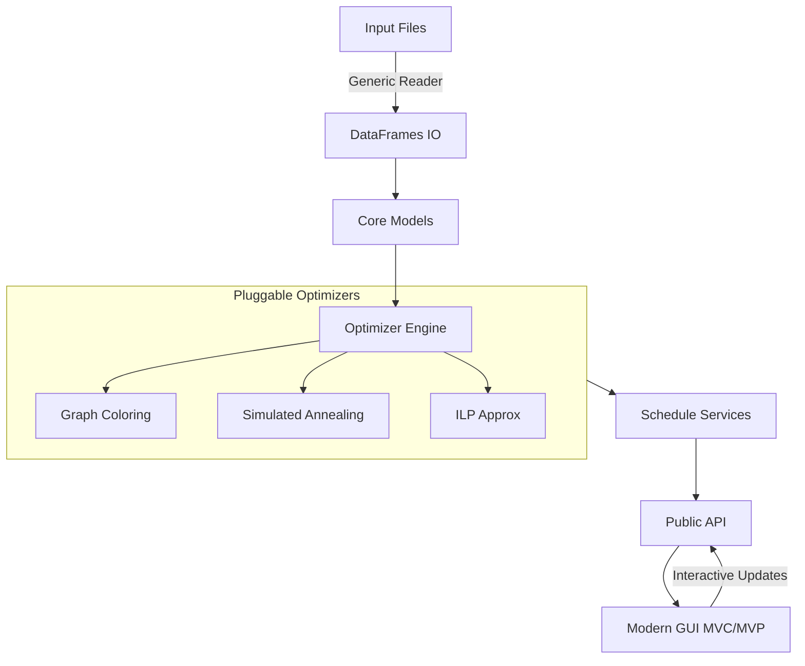
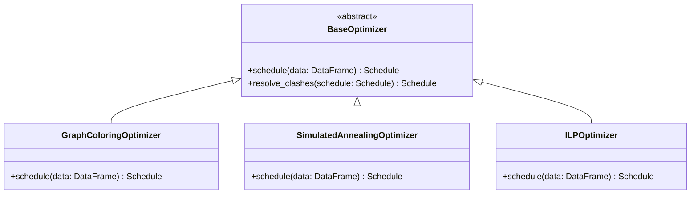
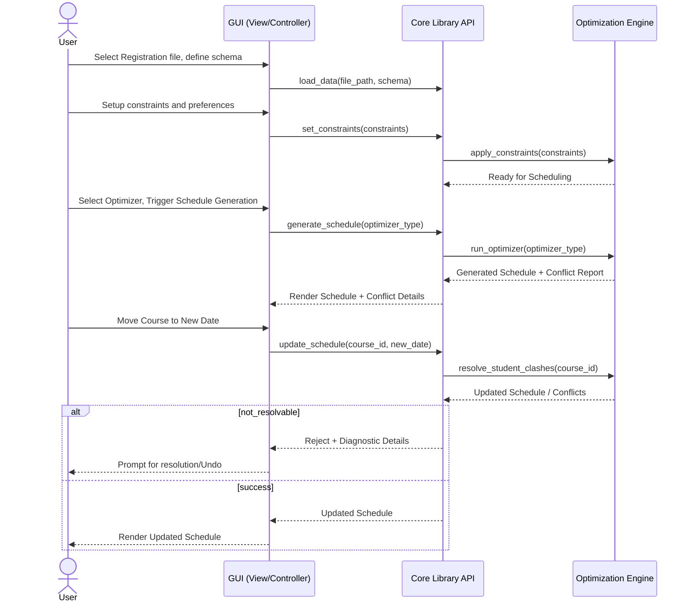

# Unisched Reimplementation Project Plan

## 1. Objective and Scope

The goal of this project is to create a university exam scheduler framework in a highly structured, scalable, and modern Python library and application. The project strictly adheres to Object-Oriented Programming (OOP) principles, emphasizing modularity, extensibility, and maintainability.

### Core Features
- **Generic Data Pipeline**: Standardized file reading, bringing all inputs into a single format (pandas `DataFrame` instead of raw graph structures for data handling) utilized by the entire library.
- **Pluggable Optimizer Architecture**: An extensible approach utilizing inheritance to support multiple scheduling algorithms.
- **Advanced Hall Allocation**: Dedicated algorithms to optimally assign lecture halls.
- **Stable Public API**: A well-documented interface for advanced users to leverage the package programmatically.
- **Modern Responsive GUI**: A clean, MVVM-based graphical interface with real-time interactive scheduling adjustments supported by the core library.

## 2. Architectural Design

I plan to adopt a layered architecture.

### 2.1 Core Modules
1. **`unisched.core`**: Base classes, interfaces, schemas, and common utilities.
2. **`unisched.io`**: Generic file reading (CSV, Excel, etc.) converting incoming data into standard pandas DataFrames.
3. **`unisched.models`**: Domain models (`Course`, `ExamHall`, `TimeSlot`, `Schedule`, `Constraint`).
4. **`unisched.optimizers`**: The optimization engine and algorithm implementations.
5. **`unisched.services`**: The business logic layer that orchestrates scheduling, validation, and interactive updates.
6. **`unisched.gui`**: The presentation layer (MVC/MVP/MVVM) completely decoupled from scheduling logic.

### 2.2 Optimizer Architecture (OOP)
A base `BaseOptimizer` class will define the interface for all scheduling algorithms. This ensures extensibility.

* **BaseOptimizer** (Abstract Base Class)
    * `GraphColoringOptimizer`
    * `SimulatedAnnealingOptimizer`
    * `ILPOptimizer` (Integer Linear Programming)

### 2.3 Interactive GUI and Core Support
To support on-the-fly updates, the core library will provide specific service methods:
- `move_course_and_resolve(course_id, new_date)`: Moves a course and attempts to rearrange others to resolve student clashes.
- `reassign_hall_and_resolve(course_id, new_hall_id)`: Changes a hall and rearranges to resolve hall capacity/overlap clashes.

## 3. Road Map

### Phase 1: Foundation & Data Pipeline
- Define base OOP models (`Course`, `Student`, `ExamHall`, `TimeSlot`).
- Implement the `io` module to read various formats and normalize into `pandas.DataFrame`.
- Implement data validation and structural boundaries.

### Phase 2: Optimizer Framework & Graph Coloring
- Create the `BaseOptimizer` interface.
- Implement the `GraphColoringOptimizer` as the first concrete algorithm (adapting the old logic but in the new structure).
- Implement the baseline hall allocation algorithm.

### Phase 3: Advanced Optimizers & Hall Allocation
- Add `SimulatedAnnealingOptimizer` and `ILPOptimizer`.
- Refine the optimal hall allotting algorithm for better utilization and less fragmentation.

### Phase 4: Core Services for Interactivity
- Implement the core business logic for manual overrides.
- Implement clash detection and automatic localized conflict resolution (`move_course_and_resolve`).

### Phase 5: Stable API & Documentation
- Define and expose the public API for the library.
- Add comprehensive docstrings and type hinting.
- Ensure the library operates smoothly head-less (without GUI).

### Phase 6: Modern GUI Implementation
- Set up the MVC/MVP/MVVM architecture for the GUI.
- Build a responsive interface (e.g., using PyQt6/PySide6, CustomTkinter, or a web-based UI).
- Integrate the GUI with the core API to support visualization and drag-and-drop/on-the-fly updates.

## 4. Mermaid Diagrams

### 4.1 High-Level Architecture

### 4.2 Class Hierarchy for Optimizers

### 4.3 Workflow sequence

## Final Note
All the functions are just for demonstration purposes and are not actual implementations. The project will be developed iteratively, with continuous testing and refactoring to ensure a robust and maintainable codebase.
