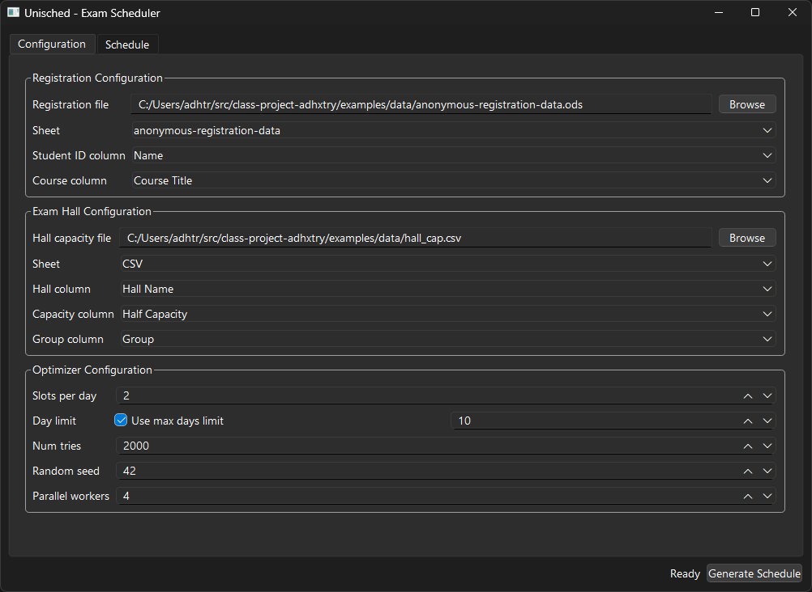

<center>

# Unisched - Extensible University Exam Scheduler



</center>

---

**Unisched** is a modular, extensible university exam scheduling library and application that supports:

- Registration data loading and schema validation from CSV, Excel (`.xlsx`), and OpenDocument (`.ods`)
- Exam hall capacity loading with room grouping and capacity constraints
- Pluggable optimization framework with multiple scheduling strategies
- Hard constraint conflict avoidance and soft constraint (same-day conflict) penalty minimization
- Schedule exporting to CSV, Excel, and ODS formats
- Native desktop GUI built with PySide6 (MVVM architecture) with live progress tracking
- Clean, headless Python API for automated workflows

---

## Installation

### From PyPI

```bash
pip install unisched

# Run the GUI application
python -m unisched
```

It is recommended to use `pipx` for isolated CLI execution:

```bash
pipx install unisched

# Run the app directly
unisched
```

### Running from Source

Prerequisites:
- Python 3.12 (`>=3.12,<3.13`)
- [`uv` package manager](https://github.com/astral-sh/uv)

Install core dependencies:

```bash
uv sync
```

Run the GUI app:

```bash
uv run unisched
```

---

## Optimizers

Unisched features a pluggable optimization architecture built upon `BaseOptimizer`.

### 1. Graph Coloring Optimizer (`GraphColoringOptimizer`)
Constructs conflict-free exam timetables using an enhanced **DSatur (Degree of Saturation)** graph coloring algorithm:
- **Incremental DSatur**: Dynamically maintains saturation degrees for high throughput ($O(V + E)$).
- **Inverted Index Conflict Graph**: Fast conflict detection directly from student registrations.
- **Objective-Aware Slot Selection**: Scores candidate slots by soft same-day penalty impact, room fit, and least constraining value (LCV).
- **Kempe-Chain Local Repair**: Resolves tight coloring bottlenecks by recoloring conflicting neighbors.
- **GRASP Local Descent**: Fine-tunes completed colorings with non-destructive two-slot hall reallocation sweeps to drive soft penalties down.
- **Parallel Multi-threading**: Runs repeated stochastic attempts across `n` worker threads.

```python
from unisched.core import GraphColoringOptimizer, SchedulingCoordinator

coordinator = SchedulingCoordinator(
    optimizer=GraphColoringOptimizer(
        num_tries=64,
        random_seed=42,
        n=4,
    ),
    slots_per_day=2,
    max_days=8,
)
```

### 2. Simulated Annealing Optimizer (`SimulatedAnnealingOptimizer`)
An iterative metaheuristic local search optimizer designed to heavily optimize soft penalties:
- Seeded with an initial feasible coloring from DSatur.
- Explores neighbor states via fast single-course perturbations.
- Computes $O(\text{degree})$ incremental penalty deltas with exponential cooling.
- Efficiently verifies hall feasibility on affected slots only.

```python
from unisched.core import SimulatedAnnealingOptimizer, SchedulingCoordinator

coordinator = SchedulingCoordinator(
    optimizer=SimulatedAnnealingOptimizer(
        iterations=50_000,
        initial_temperature=10.0,
        cooling_rate=0.9998,
        random_seed=42,
    ),
    slots_per_day=2,
    max_days=8,
)
```

---

## Development

### Code Formatting

The project uses [Black](https://github.com/psf/black) with standard configuration (`line-length = 100`, `skip-string-normalization = true`):

```bash
# Install dev dependencies
uv sync --extra dev

# Format code
uv run black .

# Check formatting
uv run black --check .
```

### Running Tests

Run the full pytest suite:

```bash
uv sync --extra dev
uv run pytest
```

### Example Script

Run the included benchmark scheduling script on anonymized data:

```bash
uv sync --extra example
uv run python examples/schedule.py
```

---

## Roadmap

- [x] DSatur Graph Coloring Optimizer with Kempe-chain repair and local descent
- [x] Simulated Annealing Optimizer
- [x] Native PySide6 Desktop GUI with parameter configuration
- [x] Multi-format data loader and exporter (CSV, Excel, ODS)
- [ ] Integer Linear Programming (ILP) Optimizer
- [ ] Interactive manual schedule fine-tuning in GUI
- [ ] Custom logo for GUI application

